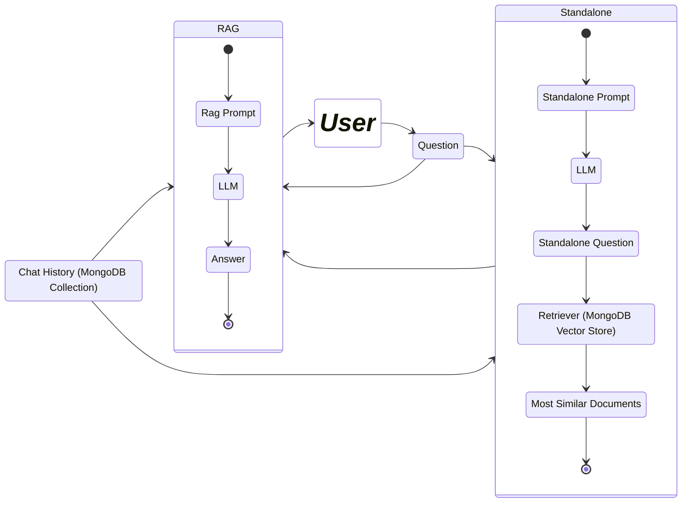

# Q&A Nutrition Bot

This repository contains the source code for the Telegram bot *@QANutritionBot* that utilizes a generative AI application.
In particular, the bot is designed to use Retrieval-augmented Generation (RAG) to answer user questions related to transcriptions from a YouTube [channel](https://www.youtube.com/channel/UCuCdPgseAOAS_ZWgUeIlFNg) focused on nutrition.
Transcriptions are indexed using a vector search index on [MongoDB Atlas](https://www.mongodb.com/atlas) and saved in a particular collection.

The bot is built using Node.js and the [Telegraf](https://telegraf.js.org/) library.
It use a [Cohere](https://cohere.com/) model to create embeddings for the transcriptions and user questions.
It exploit [Together AI](https://www.together.ai/) to access the LLM model and uses [Langchain](https://js.langchain.com/v0.2/docs/introduction/) to interact with the model.


## Main Components

- **Data Ingestion**: Data is acquired by extracting transcriptions from YouTube video subtitles, splitting them into paragraphs, using a [Recursive Text Splitter strategy](https://js.langchain.com/v0.1/docs/modules/data_connection/document_transformers/), indexed using a vector index, and stored in a MongoDB Atlas cluster.

- **Telegram Bot**: The bot is built using the Telegraf library and is capable of answering user questions using a chained approach. 
The process to generate an answer is as follows:

1) It first use user question into a prompt, with chat history, and then use the LLM model to reformulate the question based on the chat history context. The reformulated question is then embedded and used to query the MongoDB Atlas Vector datastore to retrieve the most relevant transcriptions.
2) Original user question with the chat history and the retrieved transcriptions are then used in an another prompt to generate the answer using the LLM model.
3) The answer is then sent back to the user, and the chat history is updated.

This approach allows the bot to provide more accurate and relevant answers to user questions and is heavily inspired by this article: [Advanced Rag Langchain Mongodb Application](https://www.mongodb.com/developer/products/atlas/advanced-rag-langchain-mongodb/).

The following state diagram shows the flow of the above process:



## Runtime
The bot is deployed on vercel, and the code is run on a serverless function. The bot is triggered by a webhook, and the serverless function is executed when a user sends a message to the bot. The bot then processes the user's message and sends a response back to the user.

## Requirements
You need the following to run the bot:

- A Telegram Bot Token: You can get this by creating a new bot using the [BotFather](https://core.telegram.org/bots#6-botfather).
- A YouTube Channel ID: You can get this by visiting the YouTube channel and copying the channel ID from the URL.
- A MongoDB Atlas Cluster: You can create a free cluster on [MongoDB Atlas](https://www.mongodb.com/atlas).
- An Atlas Vector Search Index: You can create a vector search index on MongoDB Atlas using the [Atlas Vector Search](https://www.mongodb.com/docs/atlas/atlas-vector-search/tutorials/vector-search-quick-start/).
  In this project, the index is created with the following configuration:
  ```json
   {
      "fields": [
         {
            "numDimensions": 1024,
            "path": "embedding",
            "similarity": "euclidean",
            "type": "vector"
         }
      ]
   }
   ```
- A Cohere API Key: You can get this by signing up on the [Cohere](https://cohere.com/) website.
- A Together AI API Key: You can get this by signing up on the [Together AI](https://www.together.ai/) website.
- A llm model name: You can get this, experimenting with the models available on the Together AI website. For this project, i have used the model `meta-llama/Llama-3-70b-chat-hf`.
- A Webhook URL: You can use a service like [ngrok](https://ngrok.com/) to create a secure tunnel to your local server and use the URL as the webhook URL. Or you can deploy the bot on a serverless function and use the URL of the function as the webhook URL.


## Ingestion  

Before running the bot, you need to ingest the data from the YouTube channel into the MongoDB Atlas cluster.
To do this, you can run the script `ingest.js` in the `src/lib` directory. This script will extract the transcriptions from the YouTube channel, split them into paragraphs, and index them using a vector index on MongoDB Atlas.

To run the script, you need to set up the environment variables in a `.env` file in the root directory of the project and run the following command:

```bash
yarn ts-node src/lib/ingest.js
```
The process may take some time depending on the number of videos and the length of the transcriptions.

## Configuration

To run the bot in your local environment, you need to set up the environment variables, expose the local server to the internet, and start the bot.

### Set Environment Variables
Create a `.env` file in the root directory of the project and add the following environment variables:

```bash
TELEGRAM_BOT_TOKEN = YOUR_TELEGRAM_BOT_TOKEN
YOU_TUBE_CHANNEL_ID = YOUR_YOUTUBE_CHANNEL_ID
MONGO_DB_ENDPOINT = YOUR_MONGO_DB_ENDPOINT
MONGO_DB_USER = YOUR_MONGO_DB_USER
MONGO_DB_PASSWORD = YOUR_MONGO_DB_PASSWORD
MONGO_DB_NAME = YOUR_MONGO_DB_NAME
MONGO_DB_COLLECTION = YOUR_MONGO_DB_COLLECTION
MONGO_DB_HISTORY_COLLECTION = YOUR_MONGO_DB_HISTORY_COLLECTION
ATLAS_INDEX_NAME = YOUR_ATLAS_INDEX_NAME
COHERE_API_KEY = YOUR_COHERE_API_KEY
TOGETHER_API_KEY = YOUR_TOGETHER_API_KEY
MODEL_NAME = YOUR_MODEL_NAME
WEBHOOK_URL = YOUR_WEBHOOK_URL
```

### Install Dependencies

```bash
yarn install
```

### Expose Local Server to the Internet (manually)

You can use a service like [ngrok](https://ngrok.com/) to expose your local server to the internet. 
To do this, you need to install ngrok client (this repo already has ngrok installed as a dev dependency), login to your account, retrieve your authtoken, and run the following command:

```bash
NGROK_AUTHTOKEN="YOUR NGROK AUTHTOKEN" yarn ngrok http 3000
```

### Set Webhook URL

Set the webhook URL in your .env file to the URL generated by ngrok plus the `/api/bots` path. For example:

```bash
WEBHOOK_URL = https://your-ngrok-url.ngrok.io/api/bots
```

### Expose Local Server to the Internet (script)
The project has a script that can be used to expose the local server to the internet using ngrok, and update the webhook URL in the .env file. To run the script, use the following command:

```bash
NGROK_AUTH_TOKEN="YOUR NGROK AUTHTOKEN" yarn start-ngrok
```

### Start the Bot

Finally, you can start the bot by running the following command:

```bash
yarn dev
```

### Chat with the Bot

You can now start a chat with the bot on Telegram by searching for *@YourBotName* and sending a message to the bot.

## Customization

The project is highly customizable due to the use of environment variables. Modify the code and configurations to tailor it to your specific needs. So you can create your own bot with your own data and models.